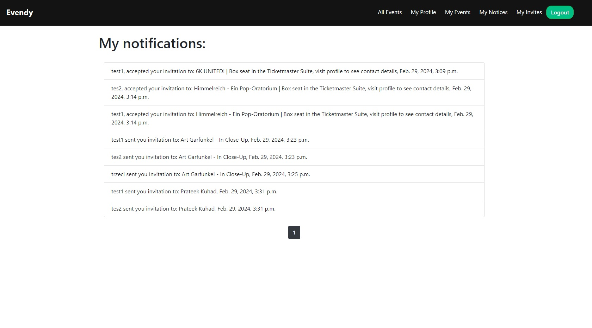
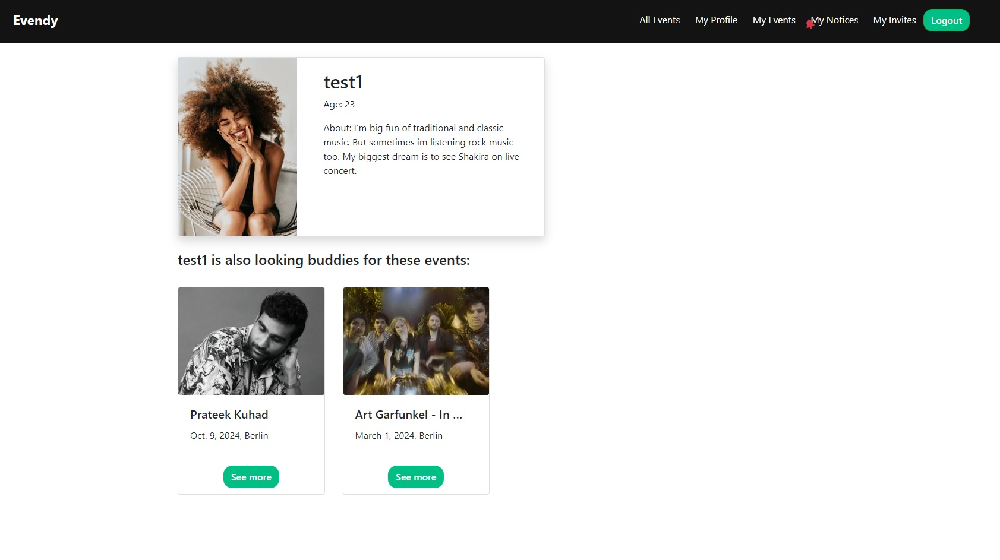

# Evendy     

This simple app will help you find a companion for any musical event in Germany. You can sign up as a companion seeker or search among the already signed up seekers. 
Send invitations or receive them from others - you can decide for yourself who you will go to the event with.
The application was written based on the Django framework. The Ticketmaster Discovery API was used to retrieve event data.


### Technologies
<ul>
<li>Python 3.11</li>
<li>Django</li>
<li>HTML5, CSS3</li>
<li>Bootstrap 4</li>
<li>Docker, docker-compose</li>
</ul>

### Requirements to setup
<ul>
<li>Docker</li>
<li>Docker Compose</li>
</ul>

### Setup
<ol>
<li>Clone this repo:</li>

```git clone https://github.com/marcho4917/Evendy-project.git```

<li>Go to the directory:</li>

```cd Evendy-project```

<li>Start the application using Docker Compose:</li>

```docker compose up --build```

</ol>

The application will be available at http://localhost:8000.

### App functionalities

<ul>
<li>User registration: The app allows users to register an account, allowing them full access to the app's features.</li>
<li>Event Search: Users can browse the list of available events, search them using the search engine.</li>
<li>Participating in events: Users can join events in which they are interested and for which they are looking for a companion.</li>
<li>Cancellation of invitations: Users can easily manage sent and received invitations in the "My invites" tab.</li>
<li>Updating data: Registered users have the possibility to update their profile information.</li>
</ul>

### Preview views

Main Page|Login user view
:-------------------------:|:-------------------------:
Event view|Login
Logout|Register
Profile view|Invitations
Notifications|Another User