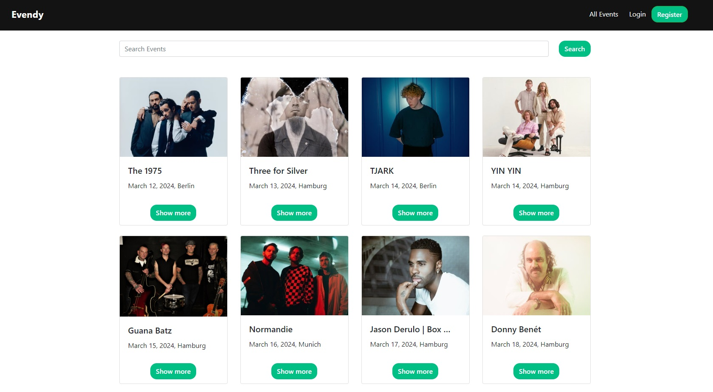
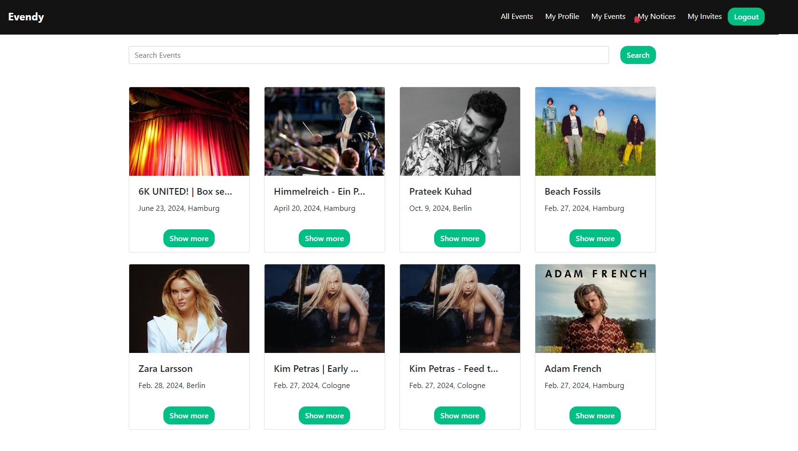
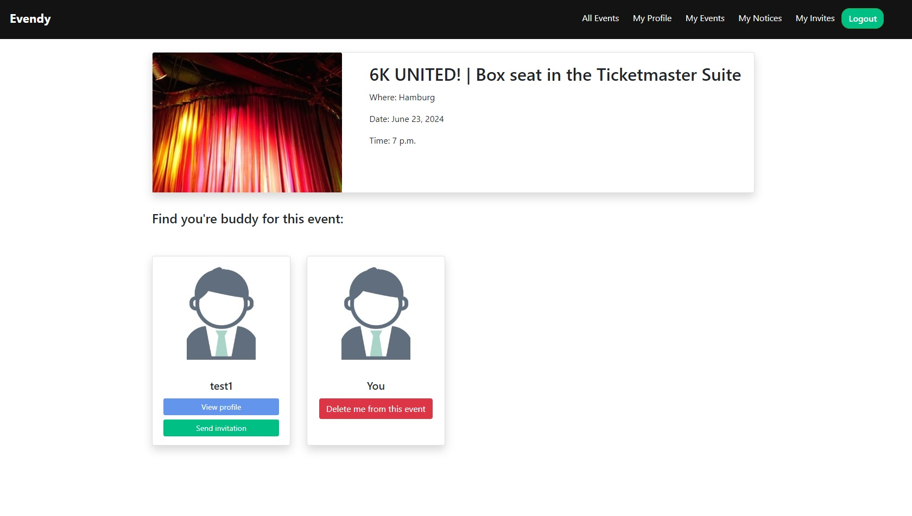
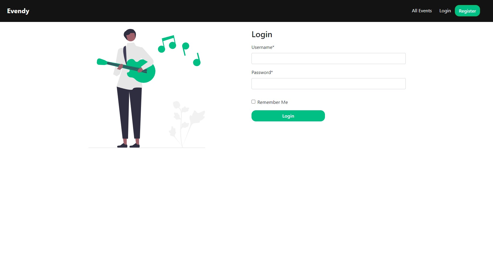
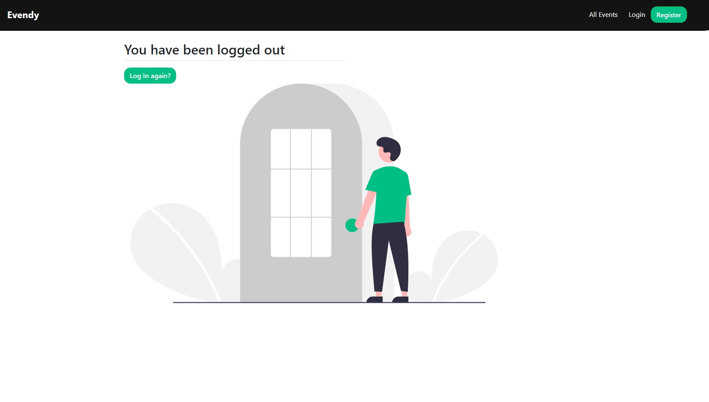
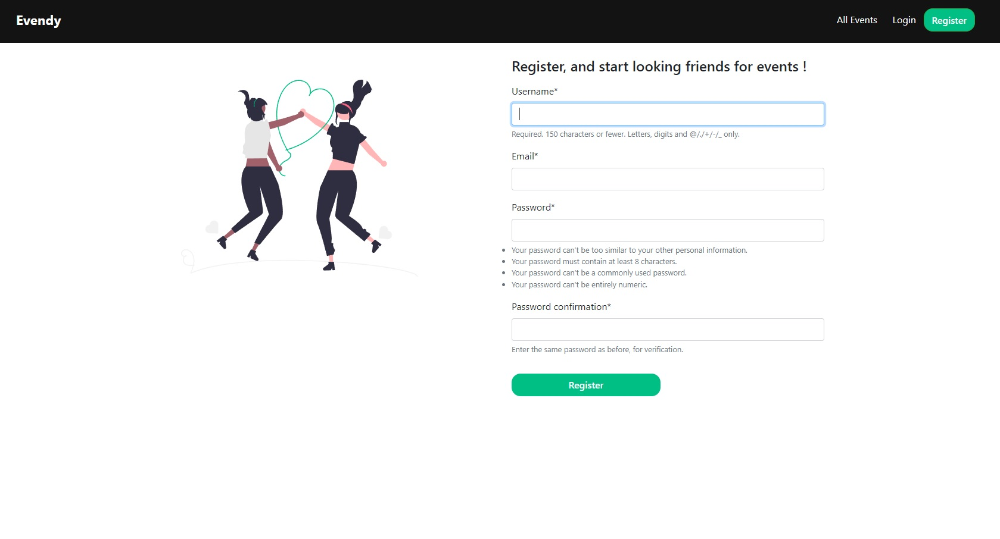
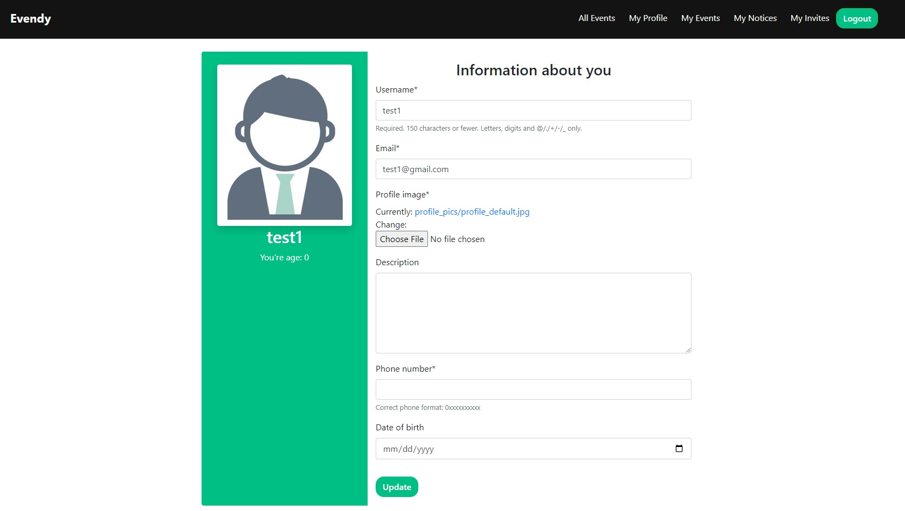
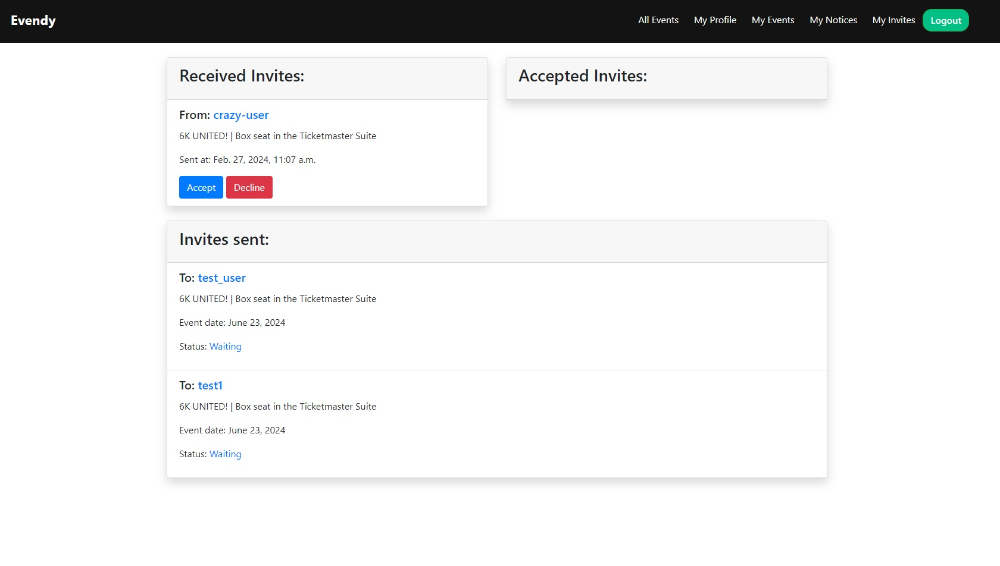

# Evendy     

This simple app will help you find a companion for any musical event in Germany. You can sign up as a companion seeker or search among the already signed up seekers. 
Send invitations or receive them from others - you can decide for yourself who you will go to the event with.
The application was written based on the Django framework. The Ticketmaster Discovery API was used to retrieve event data.


### Technologies
<ul>
<li>Python 3.11</li>
<li>Django</li>
<li>HTML5, CSS3</li>
<li>Bootstrap 4</li>
<li>Docker, docker-compose</li>
</ul>

### Setup
Run in the command line:
```docker run my_name/repo_name:version```


### Preview views

Main Page|Login user view
:-------------------------:|:-------------------------:
Event view|Login
Logout|Register
Profile view|Invitations